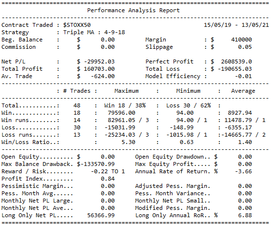

# tradingsystems
## End of day backtesting of technical trading rules

&nbsp;  

### Installation
Install from PyPI:
```
$ pip install tradingsystems
```

&nbsp;

To install in new environment using anaconda:
```
$ conda create --name systems
```
Activate new environment
```
$ activate systems
```
Install Python
```
(systems) $ conda install python==3.8.8
```
Install Spyder
```
(systems) $ conda install spyder==4.2.5
```
Install Pandas
```
(systems) $ conda install pandas==1.1.4
```


Install tradingsystems
```
(systems) $ python -m pip install tradingsystems
```

&nbsp;

### Setup

Import tradingsystems and initialize a Data object 
```
import tradingsystems.systems
data = systems.Data()
```
Run the Triple MA Cross strategy against Eurostoxx Index data.
```
data.test_strategy_3MA(ticker='$STOXX50')
```

&nbsp;

### Output

A table of results is printed to the console

