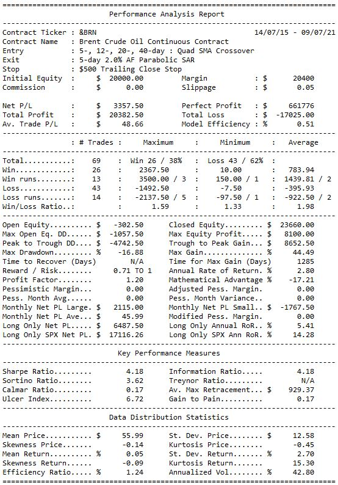

# tradingsystems
## End of day backtesting of Technical trading rules

&nbsp;  

### *** Still under development ***
#### Performance data requires additional fields populated
#### TBA Dynamic position sizing, Equity / Margin figures need refining

&nbsp;

Entry strategies: 
  - Double MA Crossover
  - Triple MA Crossover
  - Quad MA Crossover
  - Parabolic SAR
  - Channel Breakout
  - Stochastic Crossover
  - Stochastic Over Under
  - Stochastic Pop
  - Relative Strength Index
  - Commodity Channel Index
  - Momentum
  - Volatility

&nbsp;

Exit strategies:
  - Parabolic SAR
  - Support / Resistance
  - Trailing Relative Strength Index
  - Key Reversal Day
  - Trailing Stop
  - Volatility
  - Stochastic Crossover
  - Profit Target
  - High/Low Range
  - Random

&nbsp;

Stop strategies:
  - Initial Dollar
  - Support / Resistance
  - Immediate Profit
  - Breakeven
  - Trailing Close Stop
  - Trailing High / Low Stop

&nbsp;

### Installation
Install from PyPI:
```
$ pip install tradingsystems
```

&nbsp;

To install in new environment using anaconda:
```
$ conda create --name systems
```
Activate new environment
```
$ activate systems
```
Install Python
```
(systems) $ conda install python==3.8.8
```
Install Spyder
```
(systems) $ conda install spyder==4.2.5
```
Install Pandas
```
(systems) $ conda install pandas==1.1.4
```


Install tradingsystems
```
(systems) $ python -m pip install tradingsystems
```

&nbsp;

### Setup

Import tradingsystems and initialize a Data object 
```
import tradingsystems.systems
data = systems.Data()
```
Run the Quad MA Cross entry strategy for 6 years against Brent Crude futures with a Parabolic SAR exit and a Trailing Close Stop.
```
data.test_strategy(ticker='&BRN', lookback=1500, entry_type='4ma', exit_type='sar', stop_type='trail_close')
```

&nbsp;

### Output

A table of results is printed to the console



&nbsp;

Gamestop with a 3MA entry


&nbsp;


The following volumes served as a reference for some of the methods and report design:
* [Design, Testing, and Optimization of Trading Systems, Robert Pardo]
* [Technical Traders Guide to Computer Analysis of the Futures Markets, Charles LeBeau & David W. Lucas]

[Design, Testing, and Optimization of Trading Systems, Robert Pardo]:
<https://www.amazon.co.uk/Testing-Optimization-Trading-Trader′s-Exchange/dp/0471554464/>  

[Technical Traders Guide to Computer Analysis of the Futures Markets, Charles LeBeau & David W. Lucas]:
<https://www.amazon.co.uk/Technical-Traders-Computer-Analysis-Futures/dp/1556234686/>

