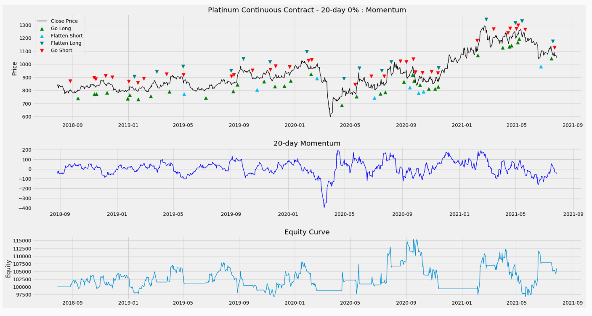

# tradingsystems
## End of day backtesting of Technical trading rules

 

### Entry strategies: 
  - Double MA Crossover
  - Triple MA Crossover
  - Quad MA Crossover
  - Parabolic SAR
  - Channel Breakout
  - Stochastic Crossover
  - Stochastic Over Under
  - Stochastic Pop
  - Relative Strength Index
  - Commodity Channel Index
  - Momentum
  - Volatility

 

### Exit strategies:
  - Parabolic SAR
  - Support / Resistance
  - Trailing Relative Strength Index
  - Key Reversal Day
  - Trailing Stop
  - Volatility
  - Stochastic Crossover
  - Profit Target
  - High/Low Range
  - Random

 

### Stop strategies:
  - Initial Dollar
  - Support / Resistance
  - Immediate Profit
  - Breakeven
  - Trailing Close Stop
  - Trailing High / Low Stop

 

### Data Sources:
  - Norgate Data: Commodities (requires a [Futures package] subscription) 
  - Alpha Vantage: Cash Equities, FX, Crypto (requires an [Alpha Vantage API key])
  - Yahoo Finance: US Cash Equities

 

### Installation
Install from PyPI:
```
$ pip install tradingsystems
```

 

To install in new environment using anaconda:
```
$ conda create --name systems
```
Activate new environment
```
$ activate systems
```
Install Python
```
(systems) $ conda install python==3.9.5
```
Install Spyder
```
(systems) $ conda install spyder==5.0.5
```


Install tradingsystems
```
(systems) $ python -m pip install tradingsystems
```

 

### Setup

Import tradingsystems
```
from tradingsystems import systems
```
Run the Quad MA Cross entry strategy for 6 years against Brent Crude futures with a Parabolic SAR exit and a Trailing Close Stop. Typing ```help(systems.TestStrategy)``` gives a list of all the optional arguments.
```
strat = systems.TestStrategy(ticker='&BRN', lookback=1500, entry_type='4ma', exit_type='sar', stop_type='trail_close')
```

 

### Output

A table of results is printed to the console


 

Display a graph of the performance of the strategy with trade signals and the equity curve.
```
strat.performance_graph()
```


 

Nickel with a 14 Day Parabolic SAR entry:

```
strat = systems.TestStrategy(ticker='@NI', entry_type='sar', exit_amount=5000, stop_amount=3000)
```


 

Display a graph of the performance of the strategy with trade signals, the momentum indicator and the equity curve.
```
strat.performance_graph()
```


 

Platinum with a 20 Day Momentum entry:

```
strat = systems.TestStrategy(ticker='&PL', lookback=750, entry_type='momentum', entry_period=20)
```


 

Display a graph of the performance of the strategy with trade signals, the momentum indicator and the equity curve.
```
strat.performance_graph()
```



 

Apple with a 20 Day Channel Breakout entry:

```
strat = systems.TestStrategy(ticker='AAPL', start_date='2016-01-01', entry_type='channel_breakout', entry_period=20, ticker_source='yahoo')
```


 

Display a graph of the performance of the strategy with trade signals and the equity curve.
```
strat.performance_graph()
```


 

Wheat with a 20 Day Stochastic Pop entry:

```
strat = systems.TestStrategy(ticker='&KE', lookback=750, entry_type='stoch_pop', entry_period=20)
```


 

Display a graph of the performance of the strategy with trade signals, the slow-k and slow-d stochastics and the equity curve.
```
strat.performance_graph()
```


 

GBPUSD with a 10 Day 150% Volatility entry:

```
strat = systems.TestStrategy(ccy_1='GBP', ccy_2='USD', lookback=750, ticker_source='alpha', asset_type='fx', entry_type='volatility', exit_amount=5000, stop_amount=2000)
```


 

Display a graph of the performance of the strategy with trade signals, the 10 Day ATR and the equity curve.
```
strat.performance_graph()
```


 

The following volumes served as a reference for some of the methods and report design:
* [Design, Testing, and Optimization of Trading Systems, Robert Pardo]
* [Technical Traders Guide to Computer Analysis of the Futures Markets, Charles LeBeau & David W. Lucas]

[Design, Testing, and Optimization of Trading Systems, Robert Pardo]:
<https://www.amazon.co.uk/Testing-Optimization-Trading-Trader′s-Exchange/dp/0471554464/>  

[Technical Traders Guide to Computer Analysis of the Futures Markets, Charles LeBeau & David W. Lucas]:
<https://www.amazon.co.uk/Technical-Traders-Computer-Analysis-Futures/dp/1556234686/>

[Futures package]:
<https://norgatedata.com/futurespackage.php>

[Alpha Vantage API key]:
<https://www.alphavantage.co/support/#api-key>